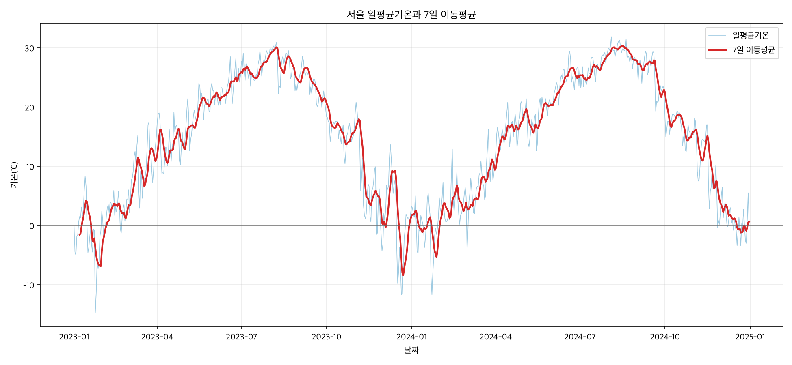
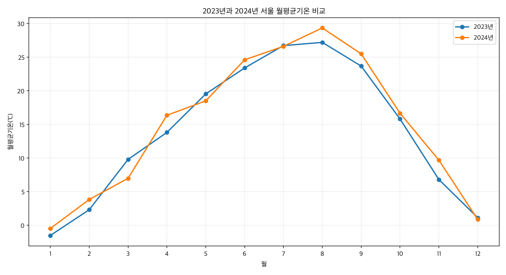
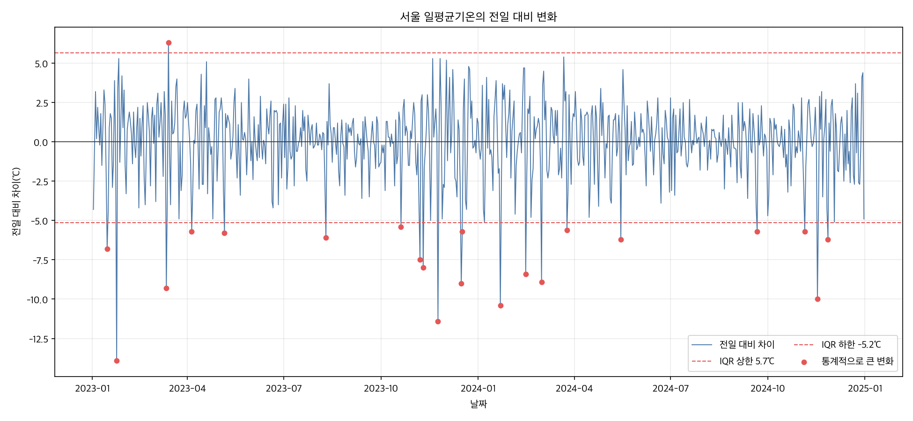
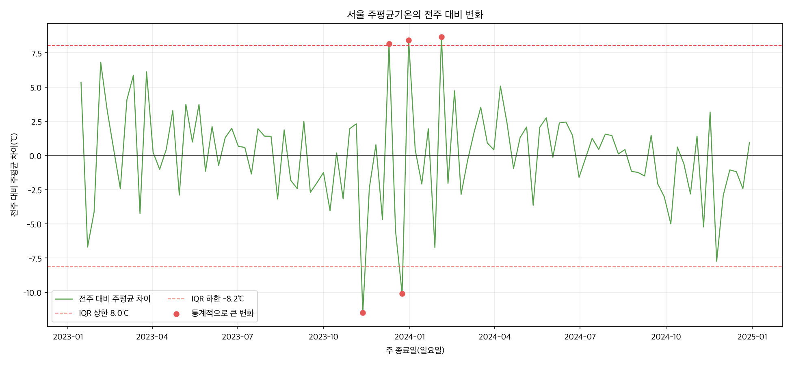

# 서울의 2023~2024년 일별 기온 변화 분석

## 1. 분석 주제 및 선정 이유

서울의 일별 기온을 통해 계절에 따른 흐름과 연도별 차이, 단기간의 큰 변화를 확인하고자 한다. 최근의 연속된 두 해인 2023년과 2024년을 선택해 같은 달의 기온 차이를 비교했다. 이 기간은 장기적인 기후변화 판단용이 아니라, 2년간의 시계열 분석 방법을 연습하기 위한 범위다.

## 2. 분석 질문

1. 2023년과 2024년의 월별 평균기온은 얼마나 달랐는가?
2. 일평균기온이 전날보다 가장 크게 상승하거나 하락한 날은 언제인가?
3. 7일 이동평균을 적용하면 일별 변동에 가려진 흐름이 어떻게 드러나는가?

## 3. 데이터 설명

- 출처: [기상청 기온분석](https://data.kma.go.kr/stcs/grnd/grndTaList.do?pgmNo=70), 서울(108)
- 대상 기간: 2023-01-01~2024-12-31
- 수집일: 2026-09-05, 사용자가 일/기본 조건의 CSV 다운로드
- 실제 데이터 수: 731개 (기간 내 모든 날짜 포함)
- 컬럼: 날짜, 지점, 평균기온(℃), 최저기온(℃), 최고기온(℃)
- 기온 결측치, 숫자 오류, 누락 날짜, 중복 날짜, 기간 밖 행: 모두 0개
- 지점은 모두 108이며 날짜는 오름차순이다.
- 이용 조건: 기상청의 [저작권 보호 및 정책](https://data.kma.go.kr/cmmn/static/staticPage.do?page=pageCr)은 자유이용 가능한 자료도 구체적인 출처 표시가 필요하며, 공공누리 표시 유형을 확인하도록 안내한다. 다운로드 화면에서 개별 자료의 공공누리 표시를 확인하지 못했으므로 원본 CSV는 GitHub에 올리지 않고 재수집 방법만 제공한다.

원본을 CP949로 읽고 검색조건 설명과 빈 줄을 제외했으며 날짜 앞뒤 공백을 제거했다. 기온 값의 삭제나 보간은 수행하지 않았다. 모든 행에서 최저기온 ≤ 평균기온 ≤ 최고기온을 확인했으나, 이는 통계적 이상치가 없다는 뜻은 아니다.

## 4. 정제 기준 및 분석 방법

### 정제 결과

- 날짜를 날짜형으로 변환하고 오름차순으로 정렬했다.
- 중복 날짜, 기간 밖 데이터, 누락 날짜를 확인한 결과 모두 0개였다.
- 기온 컬럼을 숫자로 변환했으며 결측치와 숫자 오류는 모두 0개였다.
- 모든 행에서 최저기온 ≤ 평균기온 ≤ 최고기온 관계가 성립했다.
- 전일 대비 변화에 IQR 기준을 적용했다. 기준 밖 22일도 실제 날씨 변화일 수 있으므로 삭제하거나 보간하지 않았다.

### 분석 방법

- 7일 이동평균: 하루의 일시적인 변동을 줄이고 약 1주일 단위의 흐름을 보기 위해 최근 7일의 평균을 사용했다. 완전한 7일이 없는 시작 구간은 계산하지 않는다. 5일·14일 등과 비교해 7일이 최적임을 검증한 것은 아니므로, 기간별 결과 비교는 후속 분석으로 남긴다.
- 연도별 월평균: 일별 값보다 계절 흐름을 쉽게 비교하고, 두 해의 같은 달이 얼마나 다른지 확인하기 위해 월 단위로 집계했다. 월별 유효 관측 수도 함께 확인한다.
- 전일 대비 차이: 연속된 날짜의 일평균기온 차이를 ℃로 계산한다. 날짜가 빠진 구간을 하루 변화로 처리하지 않는다.

## 5. 시각화

분석 코드가 아래 그래프 4개를 `images` 폴더에 저장하며, 상대 경로로 리포트에 연결했다.

### 5.1 일별 평균기온과 7일 이동평균

옅은 선은 하루 단위 평균기온이고 붉은 선은 최근 7일의 평균이다. 첫 6일은 완전한 7일 구간이 없어 이동평균을 계산하지 않았다.

### 5.2 2023년과 2024년의 월별 평균기온 비교

각 해의 일평균기온을 월별로 묶어 평균했다. 두 해의 같은 달을 비교하면서 계절적인 흐름과 연도별 차이를 함께 확인한다.

### 5.3 전일 대비 일평균기온 차이

평균기온에서 전날의 평균기온을 빼 하루 사이의 변화를 ℃로 계산했다. 붉은 점은 IQR 기준으로 통계적으로 큰 변화에 해당한다. 이 값은 관측 오류가 아니라 실제 날씨 변화일 수 있으므로 삭제하지 않았다.

### 5.4 집계 단위 변경에 따른 민감도 확인

집계 단위에 따라 큰 변화의 기준과 결과가 어떻게 달라지는지 확인하기 위해 일평균기온을 월요일부터 일요일까지의 주평균으로 다시 계산했다. 7일이 모두 있는 104주만 사용하고 전주 대비 주평균 차이에 IQR 방식을 적용했다. 일 단위와 주 단위는 관측 수와 분포가 다르므로, 기존 결론을 뒤집는 결과로 해석하지 않고 결과의 민감도를 확인하는 보조 분석으로 사용했다.

## 6. 인사이트

### 인사이트 1: 연도별 월평균 차이

- 관찰: 2023년 연평균기온은 14.11℃, 2024년은 14.88℃로 2024년이 0.77℃ 높았다. 12개월 중 8개월은 2024년의 월평균이 더 높았다. 차이가 가장 큰 달은 11월(+2.88℃)이었고, 2024년이 가장 낮았던 비교 달은 3월(-2.81℃)이었다.
- 해석 및 가설: 두 해 모두 겨울에 낮고 여름에 높은 계절성이 뚜렷하다. 그러나 같은 월도 해마다 차이가 커서, 2년 중 어느 한 해의 월평균을 일반적인 서울 기온으로 간주하기는 어렵다.
- 추가 확인 또는 활용: 30년 평년값과 비교하면 각 월의 차이가 단순한 연도 변동인지 이례적인 변화인지 더 잘 판단할 수 있다.

### 인사이트 2: 급격한 기온 변화

- 관찰: 가장 큰 하락은 2023년 1월 24일로, 전날 -0.8℃에서 -14.7℃로 13.9℃ 떨어졌다. 가장 큰 상승은 2023년 3월 14일로, 전날 2.9℃에서 9.2℃로 6.3℃ 올랐다. IQR 기준인 -5.2℃ 미만 또는 +5.7℃ 초과에 해당한 날은 22일이며, 하락 21일과 상승 1일이었다.
- 해석 및 가설: 이 자료에서는 통계적으로 큰 하루 변화가 상승보다 하락 쪽에 집중되었다. 급격한 찬 공기의 유입 같은 기상 상황이 가능한 원인이지만, 기온 데이터만으로 원인을 확정할 수는 없다.
- 추가 확인 또는 활용: 해당 날짜의 기상특보, 기압 배치와 풍향 자료를 함께 확인하면 급변 원인을 검토할 수 있다. IQR 기준은 관측 오류를 판정하는 기준이 아니라 추가로 살펴볼 날짜를 고르는 기준으로 사용했다.

### 인사이트 3: 이동평균으로 확인한 흐름

- 관찰: 일평균기온은 최저 -14.7℃, 최고 31.8℃였지만 7일 이동평균은 최저 -8.39℃(2023년 12월 23일), 최고 30.31℃(2024년 8월 16일)였다. 이동평균은 총 725개이며, 첫 6일은 완전한 7일 자료가 없어 계산하지 않았다.
- 해석 및 가설: 이동평균은 하루 단위의 큰 오르내림을 줄여 겨울의 저점, 여름의 고점과 계절 전환 흐름을 더 분명하게 보여준다. 반면 급격한 하루 변화는 완화되므로 이상 징후 확인에는 원자료가 함께 필요하다.
- 추가 확인 또는 활용: 전체 흐름은 이동평균 그래프로 보고, 갑작스러운 변화는 전일 대비 차이 그래프로 확인하는 방식이 적절하다.

### 민감도 확인: 집계 단위에 따라 결과가 달라질 수 있다

- 관찰: 일 단위 IQR에서는 큰 변화 22일 중 하락이 21일, 상승이 1일이었다. 주 단위로 다시 계산하면 완전한 104주에서 103개의 전주 대비 변화가 만들어졌고, 주 단위 IQR 기준(-8.15℃ 미만 또는 +8.05℃ 초과)을 벗어난 경우는 5주였다. 그중 상승은 3주, 하락은 2주였다. 가장 큰 주간 하락은 2023년 11월 12일 종료 주의 -11.49℃, 가장 큰 상승은 2024년 2월 4일 종료 주의 +8.66℃였다.
- 해석: 일 단위와 주 단위는 관측 수, 변화 범위와 IQR 기준이 서로 다르므로 이상치 개수를 직접 비교해 어느 결론이 뒤집혔다고 판단할 수는 없다. 다만 집계 단위에 따라 선택되는 큰 변화의 수와 방향이 달라질 수 있음을 확인했다.
- 활용: 분석 결론을 제시할 때 집계 단위를 함께 밝히고, 더 일반적인 판단을 하려면 더 긴 기간의 일·주·월 결과를 비교해야 한다.

## 7. 결론 및 한계점

- 결론: 두 해 모두 겨울 저점과 여름 고점이 반복되는 계절성이 뚜렷했다. 2024년 연평균은 2023년보다 0.77℃ 높았지만 월별 차이는 일정하지 않았다. 7일 이동평균은 계절 흐름을 보여주고, 전일 대비 차이는 2023년 1월 24일의 -13.9℃와 같은 급격한 변화를 찾는 데 유용했다.
- 주 단위 보조 분석에서는 일 단위와 다른 개수와 방향 비율이 나타났다. 두 집계의 조건이 다르므로 결론의 반전으로 보지는 않았으며, 해석할 때 분석 단위를 반드시 함께 제시해야 한다.
- 두 해의 관측만으로 장기적인 기후변화 추세를 판단할 수 없다.
- 단일 관측소는 서울 모든 지역의 기온 차이를 반영하지 않는다.
- 기온만으로 급변 원인을 확정할 수 없으며 기상 자료 등 추가 근거가 필요하다.
- 월별 표본 수가 달라질 수 있으며 2024년은 윤년이다. 연평균 비교에 미치는 영향은 작지만 같은 조건의 장기 자료로 추가 확인할 필요가 있다.

## 8. AI 사용 로그

| 사용 작업 | 사용 이유 | 검증 방법 및 현재 상태 |
|---|---|---|
| 분석 질문과 프로젝트 구조 초안 | 과제 요구사항을 정리하기 위해 | 제공된 과제와 대조해 질문 3개, 분석 기법 2개 이상, 필수 분석 그래프 3개와 민감도 그래프 1개를 확인함 |
| 환경 확인 코드와 리포트 틀 작성 | 초기 파일 준비 시간을 줄이기 위해 | 환경 확인 코드를 실행해 Python 버전과 분석 기간 731일을 확인함 |
| CSV 기본 품질 검사 코드 작성 | 인코딩 및 날짜 누락, 결측치 등을 일관되게 확인하기 위해 | 실제 원본에 실행해 731개 관측을 확인함. 원본의 기간과 지점을 대조하고 날짜 집합을 전체 731일과 비교함 |
| 이동평균·월평균·전일 차이 계산과 시각화 | 반복 계산을 줄이고 분석 방법의 대안을 탐색하기 위해 | 스크립트를 다시 실행해 같은 수치와 PNG 4개가 재생성되는지 확인하고 그래프의 축·범례·한글 표시를 직접 확인함 |
| 인사이트와 문장 초안 | 관찰과 해석을 구분해 정리하기 위해 | 모든 관찰 수치를 코드 출력과 대조하고, 데이터만으로 확인할 수 없는 원인은 가설로 표현함 |
| 집계 단위 민감도 분석 | 집계 단위에 따라 결과가 어떻게 달라지는지 확인하기 위해 | 완전한 7일로 구성된 104주를 다시 계산함. 단, 일·주 단위의 관측 수와 분포가 달라 이상치 개수를 직접 비교하거나 결론의 반전으로 해석하지 않음 |

### 직접 계산으로 확인한 사례

원본 CSV에서 2023년 1월 23일의 평균기온은 -0.8℃, 1월 24일은 -14.7℃였다. 두 값을 직접 계산한 전일 대비 변화는 `-14.7 - (-0.8) = -13.9℃`이며, 분석 코드가 출력한 가장 큰 하락 값과 일치했다. 이를 통해 적어도 한 사례는 AI가 작성한 코드의 결과만 믿지 않고 원본 행과 직접 대조했다.
